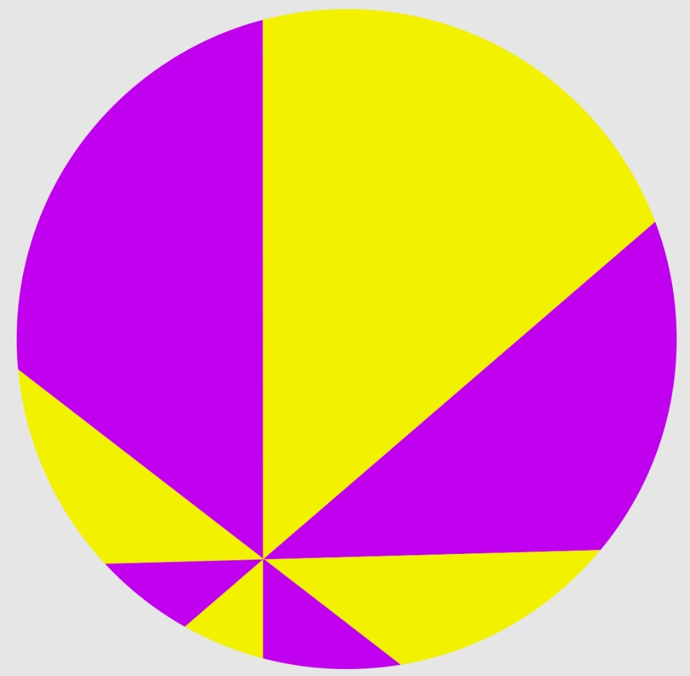

# Các công thức liên quan đến hình học phẳng

1. Với N là là số cạnh đa giác, ta có số đường chéo  $ \frac{N(N-3)}{2} $
2. Định lý pizza
    Nếu chia chiếc bánh pizza thành tám phần bởi bốn nhát cắt cùng đi qua một điểm nằm trong chiếc bánh sao cho hai nhát cắt kề nhau tạo với nhau một góc bằng 45° thì tổng diện tích của bốn phần đôi một không kề nhau này bằng tổng diện tích của bốn phần đôi một không kề nhau kia.

